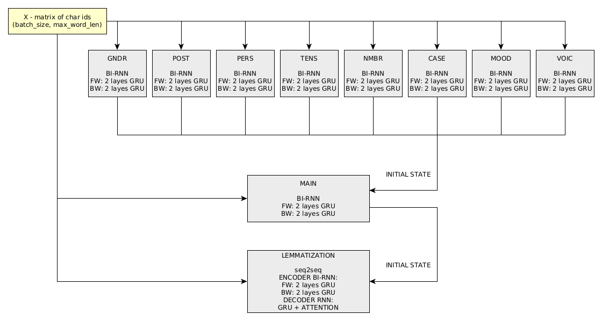

# DeepMorphy #
[](https://www.nuget.org/packages/DeepMorphy/)

DeepMorphy is a neural network based morphological analyzer for Russian language for .Net
___
DeepMorphy - морфологический анализатор для русского языка. Доступен как .Net Standart 2.0 библиотека.
Умеет проводить морфологический разбор слова (часть речи, пол, число, падеж, время, лицо) 
и приводить слова к нормальной форме. 

* [терминология](#терминология)
* [принцип работы](#принцип-работы)
    * [препроцессоры](#препроцессоры)
    * [нейронная сеть](#нейронная-сеть)
* [руководство пользователя](#руководство-пользователя)
    * [установка](#установка)
    * [начало использования](#начало-использования)
    * [морфологический разбор](#морфологический-разбор)
    * [лемматизация](#лемматизация)
* [структура репозитория](#cтруктура-репозитория)
* [планы по доработкам](#планы-по-доработкам)


## Терминология
Терминология в DeepMorphy частично позаимствована из морфологического анализатора [pymorphy2](https://pymorphy2.readthedocs.io/en/latest/).

**Граммема** (англ. grammeme) - значение одной из грамматических категорий слова (например прошедшее время, 
единственное число, мужской род).

**Грамматическая категория** (англ. grammeme category) - множество из взаимоисключающих друг друга граммем, 
характеризующих какой-то общий признак (например род, время, падеж и тп). Список всех поддерживаемых в DeepMorphy 
категорий и граммем [тут](gram.md).

**Тег** (англ. tag) - набор граммем, характеризующих данное слово
 (например, тег для слова еж - существительное, единственное число, именительный падеж, мужской род). 

**Лемма** (англ. lemma) - нормальная форма слова. 

**Лемматизация** (англ. lemmatization) - приведение слова к нормальной форме.


## Принцип работы

Основным элементом DeepMorphy является нейронная сеть. Для большинства слов морфологический анализ и лемматизация
выполняется нейронной сетью. Некоторые виды слов обрабатываются препроцессорами (если слово обработано препроцессором,
то результат сети не учитывается).

### Препроцессоры

Имеется 3 препроцессора:
* Словарь. Часть токенов просто смотрится в словаре. 
Используется для местоимений, предлогов, союзов, частиц, междометий и числительных. 
Так же в словарь заносятся токены из 
датасета, в которых сеть на тестовом прогоне после обучения делает ошибки в лемматизации.
* Препроцессор для наращенных числительных (например 1-й, 1917-й).
* Препроцессор на регулярных выражениях для пунктуации, целых цифр, римских цифр и неизвестных токенов 
(если токен состоит в основном состоит не из кириллицы).

### Нейронная сеть

Сеть построена и обучена через фреймворк [tensorflow](https://www.tensorflow.org/). 
В качестве датасета выступает словарь [Opencorpora](http://opencorpora.org/). В .Net интегрирована через 
[TensorFlowSharp](https://github.com/migueldeicaza/TensorFlowSharp).


Граф вычислений DeepMorphy состоит из 7 "подсетей":
* 6 двунаправленных рекурентных сетей (по одной для каждой поддерживаемой 
грамматической категории),
для определения граммемы в категории;
* 1 двунаправленная рекурентная сеть для определения тега сети. Для каждой комбинации тегов из датасета заведен
1 класс (всего 174 класса), сеть обучается на определение к каким классам может принадлежать данное слово. На этапе
работы берется 4 самых вероятных класса;
* 1 seq2seq модель для лемматизации.
 



Обучение сетей производится последовательно, сначала обучаются сети по категориям 
(порядок неважен). Далее обучается главная классификация по тегам и затем лемматизация. 
Обучение проводилось на 3-ех GPU Titan X. Метрики работы сети на тестовой датасете для последнего релиза можно посмотреть 
[тут](https://github.com/lepeap/DeepMorphy/blob/master/src/py/model/latest_release/test_info.txt).


## Руководство пользователя

DeepMorphy для .NET представляет собой библиотеку .Net Standart 2.0. В зависимостях только библиотека [TensorflowSharp](https://github.com/migueldeicaza/TensorFlowSharp) (Через нее запускается нейронная сеть).

### Установка

Библиотека опубликована в [Nuget](https://www.nuget.org/packages/DeepMorphy/), поэтому проще всего устанавливать через него.

Если есть менеджер пакетов:
```
 Install-Package DeepMorphy
```
Если проект поддерживает PackageReference:
```
 <PackageReference Include="DeepMorphy"/> 
```
Если кто-то хочет собрать из исходников, то C# исходники лежат [тут](https://github.com/lepeap/DeepMorphy/tree/master/src/cs). 
Для разработки используется Rider (по идее без проблем все должно собраться и в студии).

### Начало использования
Все действия осуществляются через объект класса MorphAnalyzer:
```csharp
var morph = new MorphAnalyzer();
```
В идеале лучше использовать его как синглтон, при создании объекта какое-то время уходит на загрузку словарей и сети. Потокобезопасен. При создании в конструктор можно передать следующие параметры:
* **withLemmatization** - возвращать ли леммы слов (по умолчанию - false). Если нужна лемматизация, то необходимо выставить в true, иначе лучше не включать (без флага работает быстрее).
* **useEnGrams** - использовать английские названия граммем и грамматических категорий (по умолчанию - false).
* **withTrimAndLower** - производить ли обрезку пробелов и приведение слов к нижнему регистру (по умолчанию - true).
* **withPreprocessors** - использовать ли препроцессоры перед нейронной сетью (по умолчанию - true). По идее всегда должно быть true, false ставится только для тестов.
* **maxBatchSize** - максимальный батч, который скармливается нейронной сети (по умолчанию - 4096). 
Если есть уверенность, что оперативной памяти хватит, то можно увеличивать (увеличит скорость обработки для большого количества слов).

Для анализа необходимо вызвать метод Parse (на вход принимает IEnumerable<string> со словами для анализа, возвращает IEnumerable<MorphInfo> с результатом анализа).
```csharp
var results = morph.Parse(new string[]
{
    "королёвские",
    "тысячу",
    "миллионных",
    "красотка",
    "1-ый"
}).ToArray();
var morphInfo = results[0];
```
Примеры использования [тут](https://github.com/lepeap/DeepMorphy/blob/master/src/cs/ExampleConsole/Program.cs).

### Морфологический разбор
Список поддерживаемых грамматических категорий, граммем и их ключей смотри [тут](gram.md).
Если необходимо узнать самую вероятную комбинацию граммем, то нужно использовать свойство BestTag объекта MorphInfo.
```csharp
// выводим лучшую комбинацию граммем для слова
Console.WriteLine(morphInfo.BestTag);
```
По самому слову не всегда возможно однозначно установить значения его грамматических категорий 
(см. [омонимы](https://ru.wikipedia.org/wiki/%D0%9E%D0%BC%D0%BE%D0%BD%D0%B8%D0%BC%D1%8B)),
 поэтому DeepMorphy позволяет посмотреть топ тегов для данного слова (свойство Tags).
```csharp
// выводим все теги для слова + их вероятность
foreach (var tag in morphInfo.Tags)
    Console.WriteLine($"{tag} : {tag.Power}");
```
Есть ли комбинация граммем в каком-нибудь из тегов:
```csharp
// Есть ли в каком-нибудь из тегов прилагательные единственного числа
morphInfo.HasCombination("прил", "ед");
```
Есть ли комбинация граммем в самом вероятном теге:
```csharp
// ясляется ли лучших тег прилагательным единственного числа
morphInfo.BestTag.Has("прил", "ед");
```
Получение определенных грамматических категорий:
```csharp
// выводит часть речи лучшего тега и число
Console.WriteLine(morphInfo.BestTag["чр"]);
Console.WriteLine(morphInfo.BestTag["число"]);
```

Теги применяются для случаев, если нужна информация сразу о нескольких грамматических категориях (например часть речи и число).
Если вас интересует только одна грамматическах категория, то лучше использовать интерфейс к 
вероятностям значений грамматических категорий объектов MorphInfo (на тестовом датасете точность на несколько процентов больше).

```csharp
// выводит самую вероятную часть речи
Console.WriteLine(morphInfo["чр"].BestGramKey);
```
Так же можно получить распределение вероятностей по грамматической категории:
```csharp
// выводит распределение вероятностей для падежа
foreach (var gram in morphInfo["падеж"].Grams)
{
    Console.WriteLine($"{gram.Key}:{gram.Power}");
}
```

### Лемматизация

Если необходимо приведение слов к нормальной форме, то анализатор надо создавать следующи образом:
```csharp
var morph = new MorphAnalyzer(withLemmatization: true);
```
Проверка, есть ли у данного слова лемма:
```csharp
morphInfo.HasLemma("королевский");
```


## Cтруктура репозитория
* [Python код модели, обучения и разные утилиты](https://github.com/lepeap/DeepMorphy/tree/master/src/py/model).
* [C# код DeepMorphy](https://github.com/lepeap/DeepMorphy/tree/master/src/cs).
* [Проект с C# примерами](https://github.com/lepeap/DeepMorphy/tree/master/src/cs/ExampleConsole).
* [Файлы последнего релиза](https://github.com/lepeap/DeepMorphy/tree/master/src/py/model/latest_release).


## Планы по доработкам
* Хочется улучшить точность лемматизации (в данный момент на тестовом датасете точность составляет порядка 87%).
* Подумать над оптимизацией модели на этапе применения (подумать над квантованием или обрезкой графа вычислений).

